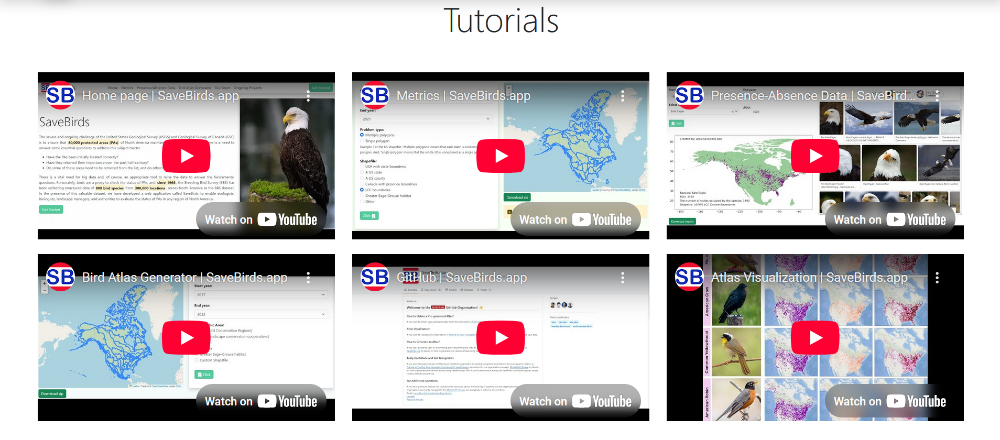

<h1 align="center">SaveBirds.app Tutorials Page</h1>

# 1. Overview
Create the Tutorials page for SaveBirds.app using Vue 3 and Bootstrap 5. This page showcases instructional videos that help users understand and effectively use the various features of the SaveBirds application.

# 2. Design Requirements

## 2.1. Layout Structure
The Tutorials page should consist of the following sections:
- **Title Section**: Page heading
- **Video Grid**: Layout of tutorial videos in a grid format
- **Reference Table**: Tabular listing of all video links

## 2.2. Visual Reference


# 3. Component Specifications

## 3.1. Title Section
- **Title**:
  - Text: "Tutorials"
  - Font: Large, bold, centered (display-4 or similar class)
  - Position: Top of the content area
  - Styling: Clean, professional appearance with appropriate spacing

## 3.2. Video Grid Layout
- **Grid Structure**:
  - Layout: 2 rows × 3 columns (6 videos total)
  - Spacing: Consistent padding between grid items
  - Responsiveness: Adapts to different screen sizes (see section 5)

- **Video Embed Component**:
  - Style: YouTube embedded player with thumbnail and play button
  - Aspect Ratio: 16:9 (standard YouTube aspect ratio)
  - Size: Consistent size across all videos
  - Border: Subtle border or shadow for visual definition
  - Hover Effect: Slight scaling or shadow change on hover
  - Controls: Standard YouTube player controls

## 3.3. Video Content

| Position      | Title                                 | YouTube URL                              |
|---------------|---------------------------------------|------------------------------------------|
| Top Left      | Home page\| SaveBirds.app             | https://youtu.be/IFbb-o4_POg             |
| Top Center    | Metrics\| SaveBirds.app               | https://youtu.be/hHcHOo5oYXc             |
| Top Right     | Presence-Absence Data\| SaveBirds.app | https://youtu.be/tn3nFSa2GEU             |
| Bottom Left   | Bird Atlas Generator\| SaveBirds.app  | https://youtu.be/huDsVljsZIc             |
| Bottom Center | GitHub\| SaveBirds.app                | https://youtu.be/fKw_LcyKndM             |
| Bottom Right  | Atlas Visualization\| SaveBirds.app   | https://youtu.be/iC3IGFMPpxU             |

- **Video Behavior**:
  - Click Action: Video should play directly on the page or open in YouTube based on implementation
  - Initial State: Display thumbnail with play button overlay
  - Caption: Video title displayed below or as an overlay

## 3.4. Reference Table
- **Table Design**:
  - Style: Clean, Bootstrap-styled table
  - Columns: Video Number/Position, Title, YouTube URL
  - Header: Bold headers with subtle background
  - Rows: Alternating row colors for readability
  - Border: Light borders for cell separation
  - Position: Below the video grid

- **Table Content**:
  - Include all videos listed in the grid
  - URLs should be clickable and open in a new tab
  - Consistent formatting for all entries

# 4. YouTube Integration

## 4.1. Embed Implementation
- **Iframe Embedding**:
  - Use YouTube's embed API for optimal performance
  - Include proper video IDs extracted from the URLs
  - Set appropriate parameters (autoplay=0, controls=1, etc.)

## 4.2. Performance Considerations
- **Lazy Loading**:
  - Implement lazy loading for videos that are not in the initial viewport
  - Only load video players when they come into view
  - Use thumbnail placeholders before loading the actual player

## 4.3. Accessibility Features
- **Required Features**:
  - Enable closed captions when available
  - Ensure keyboard navigation works properly
  - Include proper ARIA attributes for screen readers
  - Add appropriate title and alt text for thumbnails

# 5. Responsive Behavior
- **Desktop View**:
  - Full 2×3 grid layout
  - Videos sized appropriately for comfortable viewing
  - Table displayed at full width below videos

- **Tablet View**:
  - Adjust to 2×2 or 3×2 grid depending on orientation
  - Videos sized proportionally to maintain aspect ratio
  - Table may use horizontal scrolling if needed

- **Mobile View**:
  - Single column layout (videos stacked vertically)
  - Full-width videos for optimal mobile viewing
  - Responsive table with possible horizontal scroll
  - Maintained video quality and controls on small screens

# 6. Implementation Notes
- Create as a Vue component in `views/TutorialsView.vue`
- Consider creating a reusable VideoEmbed component for consistent styling
- Use Bootstrap 5 grid system for responsive layout
- Integrate YouTube iframes properly with appropriate API parameters
- Implement performance optimizations like lazy loading
- Ensure all links open in new tabs with appropriate security attributes
- Test video playback across different browsers and devices

# 7. Component Data Structure
```javascript
data() {
  return {
    tutorials: [
      {
        id: 1,
        position: "Top Left",
        title: "Home page| SaveBirds.app",
        youtubeId: "IFbb-o4_POg",
        url: "https://youtu.be/IFbb-o4_POg"
      },
      {
        id: 2,
        position: "Top Center",
        title: "Metrics| SaveBirds.app",
        youtubeId: "hHcHOo5oYXc",
        url: "https://youtu.be/hHcHOo5oYXc"
      },
      {
        id: 3,
        position: "Top Right",
        title: "Presence-Absence Data| SaveBirds.app",
        youtubeId: "tn3nFSa2GEU",
        url: "https://youtu.be/tn3nFSa2GEU"
      },
      {
        id: 4,
        position: "Bottom Left",
        title: "Bird Atlas Generator| SaveBirds.app",
        youtubeId: "huDsVljsZIc",
        url: "https://youtu.be/huDsVljsZIc"
      },
      {
        id: 5,
        position: "Bottom Center",
        title: "GitHub| SaveBirds.app",
        youtubeId: "fKw_LcyKndM",
        url: "https://youtu.be/fKw_LcyKndM"
      },
      {
        id: 6,
        position: "Bottom Right",
        title: "Atlas Visualization| SaveBirds.app",
        youtubeId: "iC3IGFMPpxU",
        url: "https://youtu.be/iC3IGFMPpxU"
      }
    ]
  }
}
```

# 8. YouTube Embed Helper Method
```javascript
methods: {
  getEmbedUrl(youtubeId) {
    return `https://www.youtube.com/embed/${youtubeId}?rel=0&controls=1`;
  }
}
```

# 9. Code Structure
- Use semantic HTML5 elements (`<section>`, `<article>`, etc.)
- Implement as a single-file component with template, script, and style sections
- Style using Bootstrap classes with minimal custom CSS
- For any custom styles, use scoped CSS to avoid conflicts
- Use v-for directives to iterate through tutorial video data
- Include appropriate error handling for video loading
